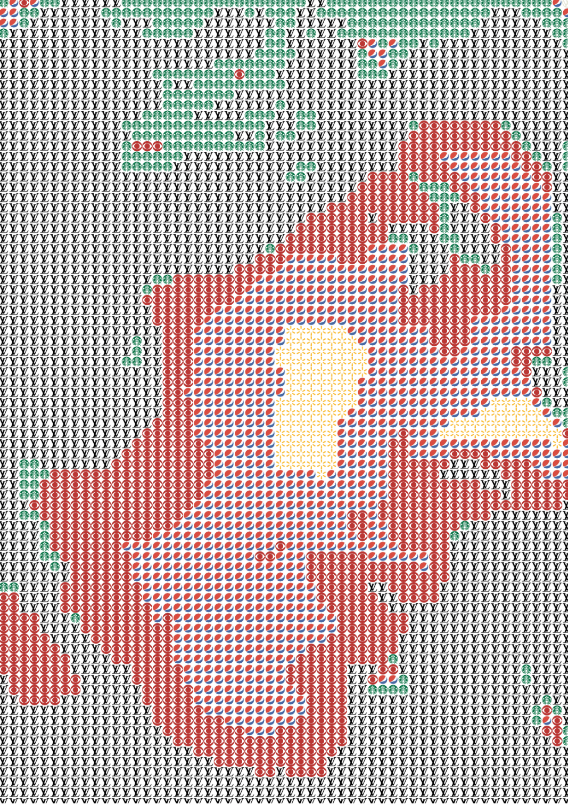

“Brand Identity” is a live video filter, written in JavaScript, which returns your image in corporate logos — great for those oligarchic solidarity events in the virtual space! This uses euclidean distance to calculate the distance (in 3d rgb space) between pixel color, as relayed by your camera’s video, and icon.
